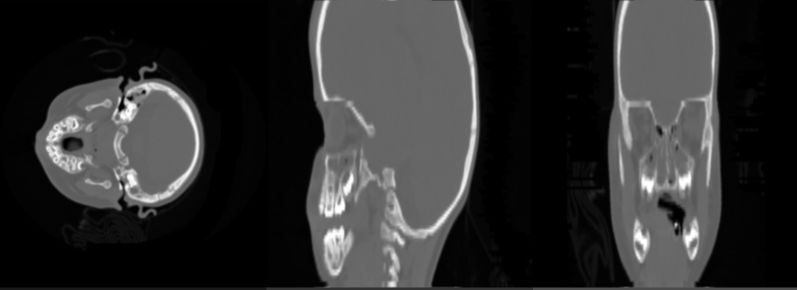

# 2D Slices images from RAW volume

This code read a volume and extract the three anatomical views from a volume. Code is using C++ and OpenGL under GLUT.

  

Each slice is displayed inside 1/3 of the viewport using orthogonal projection. The render is performed using a single textured quad, where each texture is obtained from `changeTextureAxial`, `changeTextureCoronal` and `changeTextureSagittal` functions.

The read/extraction core of the volume is getting from `CVolume` class. Also, the extracted slice, despite of being in `unsigned char values`, to simplicity each slice is in RGB format. Functions referenced to axial, coronal and sagittal, however these depend of the original orientation of the volume.

For user interaction, the 1st view (leftmost) can change the slice using the keys **1** and **2**, the 2nd view (center) can change the slice using the keys **3** and **4**, and the 3rd view (rightmost) can change the slice using the keys **5** and **6**.

All the GLUT required files are included into the repository (including the lib, dll and h). Please, uncompress the _CTHeadBabyClean256x256x94.zip file_ before to run the code.

###### If you want to contribute to this project and make it better, your help is very welcome.